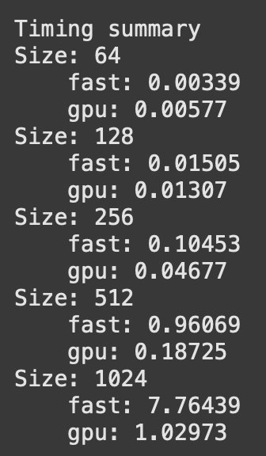
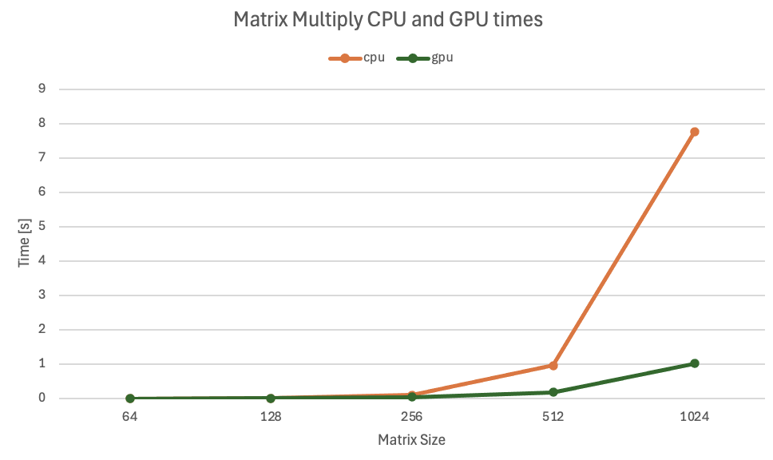
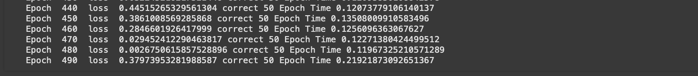
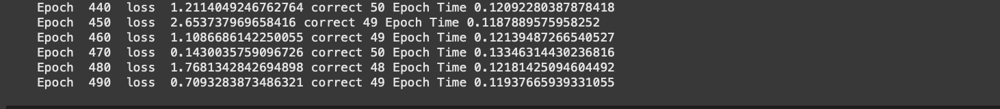
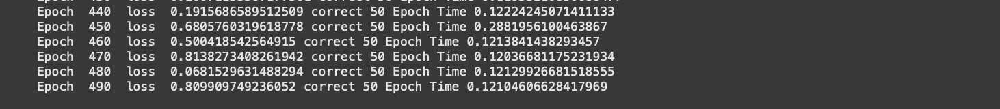
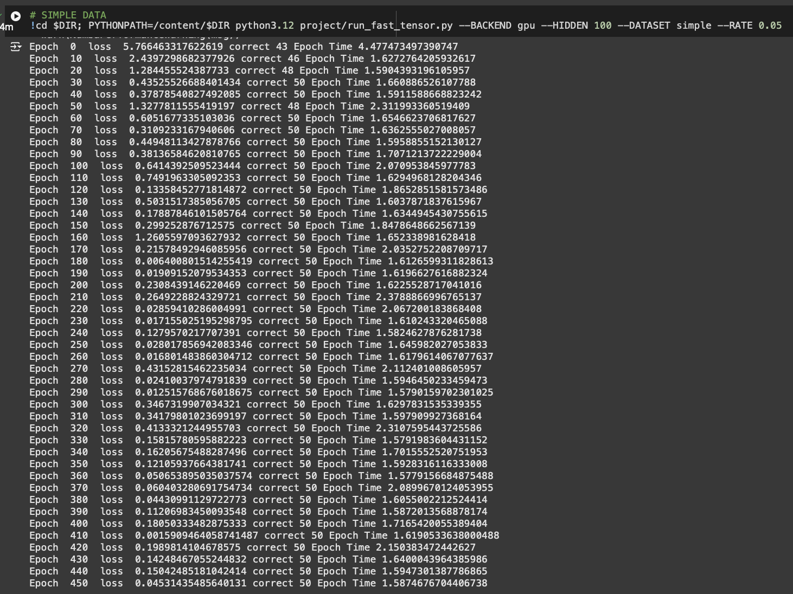
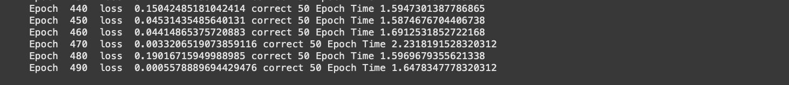
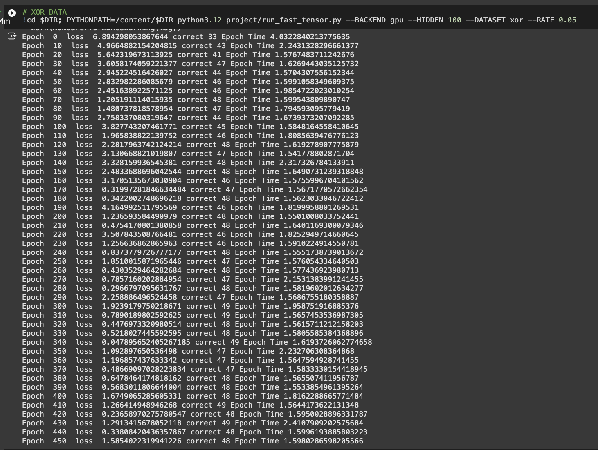
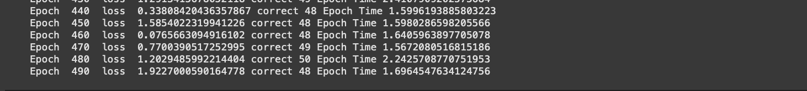
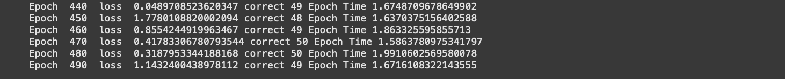

# MiniTorch Module 3


- Docs: https://minitorch.github.io/

- Overview: https://minitorch.github.io/module3.html

You will need to modify `tensor_functions.py` slightly in this assignment.

- Tests:

```
python run_tests.py
```

- Note:

Several of the tests for this assignment will only run if you are on a GPU machine and will not
run on github's test infrastructure. Please follow the instructions to setup up a colab machine
to run these tests.

This assignment requires the following files from the previous assignments. You can get these by running

```bash
python sync_previous_module.py previous-module-dir current-module-dir
```

The files that will be synced are:

        minitorch/tensor_data.py minitorch/tensor_functions.py minitorch/tensor_ops.py minitorch/operators.py minitorch/scalar.py minitorch/scalar_functions.py minitorch/module.py minitorch/autodiff.py minitorch/module.py project/run_manual.py project/run_scalar.py project/run_tensor.py minitorch/operators.py minitorch/module.py minitorch/autodiff.py minitorch/tensor.py minitorch/datasets.py minitorch/testing.py minitorch/optim.py

# TASK 3.1 & 3.2 parallel check

````bash
(.venv) (base) t-borabin@T-Bos-MacBook-Pro mod3-tbor363 % python project/parallel_check.py
MAP
OMP: Info #276: omp_set_nested routine deprecated, please use omp_set_max_active_levels instead.

================================================================================
 Parallel Accelerator Optimizing:  Function tensor_map.<locals>._map,
/Users/t-borabin/Desktop/college/9_F2024/CS
5781/minitorch_assignments/mod3-tbor363/minitorch/fast_ops.py (179)
================================================================================


Parallel loop listing for  Function tensor_map.<locals>._map, /Users/t-borabin/Desktop/college/9_F2024/CS 5781/minitorch_assignments/mod3-tbor363/minitorch/fast_ops.py (179)
-----------------------------------------------------------------------------------------|loop #ID
    def _map(                                                                            |
        out: Storage,                                                                    |
        out_shape: Shape,                                                                |
        out_strides: Strides,                                                            |
        in_storage: Storage,                                                             |
        in_shape: Shape,                                                                 |
        in_strides: Strides,                                                             |
    ) -> None:                                                                           |
        # TODO: Implement for Task 3.1.                                                  |
        # check if strides of out and in_storage are aligned                             |
        strides_aligned = np.array_equal(out_strides, in_strides) and np.array_equal(    |
            out_shape, in_shape                                                          |
        )                                                                                |
                                                                                         |
        if strides_aligned:                                                              |
            for i in prange(len(out)):---------------------------------------------------| #2
                out[i] = fn(in_storage[i])                                               |
        else:                                                                            |
            # run loop in parallel                                                       |
            for i in prange(len(out)):---------------------------------------------------| #3
                out_index: Index = np.zeros(MAX_DIMS, np.int32)--------------------------| #0
                in_index: Index = np.zeros(MAX_DIMS, np.int32)---------------------------| #1
                to_index(i, out_shape, out_index)                                        |
                broadcast_index(out_index, out_shape, in_shape, in_index)                |
                o = index_to_position(out_index, out_strides)                            |
                j = index_to_position(in_index, in_strides)                              |
                out[o] = fn(in_storage[j])                                               |
--------------------------------- Fusing loops ---------------------------------
Attempting fusion of parallel loops (combines loops with similar properties)...

Fused loop summary:
+--0 has the following loops fused into it:
   +--1 (fused)
Following the attempted fusion of parallel for-loops there are 3 parallel for-
loop(s) (originating from loops labelled: #2, #3, #0).
--------------------------------------------------------------------------------
---------------------------- Optimising loop nests -----------------------------
Attempting loop nest rewrites (optimising for the largest parallel loops)...

+--3 is a parallel loop
   +--0 --> rewritten as a serial loop
--------------------------------------------------------------------------------
----------------------------- Before Optimisation ------------------------------
Parallel region 0:
+--3 (parallel)
   +--0 (parallel)
   +--1 (parallel)


--------------------------------------------------------------------------------
------------------------------ After Optimisation ------------------------------
Parallel region 0:
+--3 (parallel)
   +--0 (serial, fused with loop(s): 1)


Parallel region 0 (loop #3) had 1 loop(s) fused and 1 loop(s) serialized as part
 of the larger parallel loop (#3).
--------------------------------------------------------------------------------
--------------------------------------------------------------------------------

---------------------------Loop invariant code motion---------------------------
Allocation hoisting:
The memory allocation derived from the instruction at
/Users/t-borabin/Desktop/college/9_F2024/CS
5781/minitorch_assignments/mod3-tbor363/minitorch/fast_ops.py (199) is hoisted
out of the parallel loop labelled #3 (it will be performed before the loop is
executed and reused inside the loop):
   Allocation:: out_index: Index = np.zeros(MAX_DIMS, np.int32)
    - numpy.empty() is used for the allocation.
The memory allocation derived from the instruction at
/Users/t-borabin/Desktop/college/9_F2024/CS
5781/minitorch_assignments/mod3-tbor363/minitorch/fast_ops.py (200) is hoisted
out of the parallel loop labelled #3 (it will be performed before the loop is
executed and reused inside the loop):
   Allocation:: in_index: Index = np.zeros(MAX_DIMS, np.int32)
    - numpy.empty() is used for the allocation.
None
ZIP

================================================================================
 Parallel Accelerator Optimizing:  Function tensor_zip.<locals>._zip,
/Users/t-borabin/Desktop/college/9_F2024/CS
5781/minitorch_assignments/mod3-tbor363/minitorch/fast_ops.py (233)
================================================================================


Parallel loop listing for  Function tensor_zip.<locals>._zip, /Users/t-borabin/Desktop/college/9_F2024/CS 5781/minitorch_assignments/mod3-tbor363/minitorch/fast_ops.py (233)
---------------------------------------------------------------------------|loop #ID
    def _zip(                                                              |
        out: Storage,                                                      |
        out_shape: Shape,                                                  |
        out_strides: Strides,                                              |
        a_storage: Storage,                                                |
        a_shape: Shape,                                                    |
        a_strides: Strides,                                                |
        b_storage: Storage,                                                |
        b_shape: Shape,                                                    |
        b_strides: Strides,                                                |
    ) -> None:                                                             |
        # TODO: Implement for Task 3.1.                                    |
                                                                           |
        strides_aligned = (                                                |
            np.array_equal(out_strides, b_strides)                         |
            and np.array_equal(out_strides, a_strides)                     |
            and np.array_equal(out_shape, a_shape)                         |
            and np.array_equal(out_shape, b_shape)                         |
        )                                                                  |
        if strides_aligned:                                                |
            for i in prange(len(out)):-------------------------------------| #7
                out[i] = fn(a_storage[i], b_storage[i])                    |
        else:                                                              |
            for i in prange(len(out)):-------------------------------------| #8
                out_index: Index = np.zeros(MAX_DIMS, np.int32)------------| #4
                a_index: Index = np.zeros(MAX_DIMS, np.int32)--------------| #5
                b_index: Index = np.zeros(MAX_DIMS, np.int32)--------------| #6
                to_index(i, out_shape, out_index)                          |
                o = index_to_position(out_index, out_strides)              |
                broadcast_index(out_index, out_shape, a_shape, a_index)    |
                j = index_to_position(a_index, a_strides)                  |
                broadcast_index(out_index, out_shape, b_shape, b_index)    |
                k = index_to_position(b_index, b_strides)                  |
                out[o] = fn(a_storage[j], b_storage[k])                    |
--------------------------------- Fusing loops ---------------------------------
Attempting fusion of parallel loops (combines loops with similar properties)...

Fused loop summary:
+--4 has the following loops fused into it:
   +--5 (fused)
   +--6 (fused)
Following the attempted fusion of parallel for-loops there are 3 parallel for-
loop(s) (originating from loops labelled: #7, #8, #4).
--------------------------------------------------------------------------------
---------------------------- Optimising loop nests -----------------------------
Attempting loop nest rewrites (optimising for the largest parallel loops)...

+--8 is a parallel loop
   +--4 --> rewritten as a serial loop
--------------------------------------------------------------------------------
----------------------------- Before Optimisation ------------------------------
Parallel region 0:
+--8 (parallel)
   +--4 (parallel)
   +--5 (parallel)
   +--6 (parallel)


--------------------------------------------------------------------------------
------------------------------ After Optimisation ------------------------------
Parallel region 0:
+--8 (parallel)
   +--4 (serial, fused with loop(s): 5, 6)


Parallel region 0 (loop #8) had 2 loop(s) fused and 1 loop(s) serialized as part
 of the larger parallel loop (#8).
--------------------------------------------------------------------------------
--------------------------------------------------------------------------------

---------------------------Loop invariant code motion---------------------------
Allocation hoisting:
The memory allocation derived from the instruction at
/Users/t-borabin/Desktop/college/9_F2024/CS
5781/minitorch_assignments/mod3-tbor363/minitorch/fast_ops.py (257) is hoisted
out of the parallel loop labelled #8 (it will be performed before the loop is
executed and reused inside the loop):
   Allocation:: out_index: Index = np.zeros(MAX_DIMS, np.int32)
    - numpy.empty() is used for the allocation.
The memory allocation derived from the instruction at
/Users/t-borabin/Desktop/college/9_F2024/CS
5781/minitorch_assignments/mod3-tbor363/minitorch/fast_ops.py (258) is hoisted
out of the parallel loop labelled #8 (it will be performed before the loop is
executed and reused inside the loop):
   Allocation:: a_index: Index = np.zeros(MAX_DIMS, np.int32)
    - numpy.empty() is used for the allocation.
The memory allocation derived from the instruction at
/Users/t-borabin/Desktop/college/9_F2024/CS
5781/minitorch_assignments/mod3-tbor363/minitorch/fast_ops.py (259) is hoisted
out of the parallel loop labelled #8 (it will be performed before the loop is
executed and reused inside the loop):
   Allocation:: b_index: Index = np.zeros(MAX_DIMS, np.int32)
    - numpy.empty() is used for the allocation.
None
REDUCE

================================================================================
 Parallel Accelerator Optimizing:  Function tensor_reduce.<locals>._reduce,
/Users/t-borabin/Desktop/college/9_F2024/CS
5781/minitorch_assignments/mod3-tbor363/minitorch/fast_ops.py (292)
================================================================================


Parallel loop listing for  Function tensor_reduce.<locals>._reduce, /Users/t-borabin/Desktop/college/9_F2024/CS 5781/minitorch_assignments/mod3-tbor363/minitorch/fast_ops.py (292)
--------------------------------------------------------------------|loop #ID
    def _reduce(                                                    |
        out: Storage,                                               |
        out_shape: Shape,                                           |
        out_strides: Strides,                                       |
        a_storage: Storage,                                         |
        a_shape: Shape,                                             |
        a_strides: Strides,                                         |
        reduce_dim: int,                                            |
    ) -> None:                                                      |
        # TODO: Implement for Task 3.1.                             |
                                                                    |
        reduce_size = a_shape[reduce_dim]                           |
        for i in prange(len(out)):----------------------------------| #10
            out_index: Index = np.zeros(MAX_DIMS, np.int32)---------| #9
            to_index(i, out_shape, out_index)                       |
            o = index_to_position(out_index, out_strides)           |
            for s in range(reduce_size):                            |
                out_index_copy = out_index.copy()                   |
                out_index_copy[reduce_dim] = s                      |
                j = index_to_position(out_index_copy, a_strides)    |
                out[o] = fn(out[o], a_storage[j])                   |
--------------------------------- Fusing loops ---------------------------------
Attempting fusion of parallel loops (combines loops with similar properties)...
Following the attempted fusion of parallel for-loops there are 2 parallel for-
loop(s) (originating from loops labelled: #10, #9).
--------------------------------------------------------------------------------
---------------------------- Optimising loop nests -----------------------------
Attempting loop nest rewrites (optimising for the largest parallel loops)...

+--10 is a parallel loop
   +--9 --> rewritten as a serial loop
--------------------------------------------------------------------------------
----------------------------- Before Optimisation ------------------------------
Parallel region 0:
+--10 (parallel)
   +--9 (parallel)


--------------------------------------------------------------------------------
------------------------------ After Optimisation ------------------------------
Parallel region 0:
+--10 (parallel)
   +--9 (serial)


Parallel region 0 (loop #10) had 0 loop(s) fused and 1 loop(s) serialized as
part of the larger parallel loop (#10).
--------------------------------------------------------------------------------
--------------------------------------------------------------------------------

---------------------------Loop invariant code motion---------------------------
Allocation hoisting:
The memory allocation derived from the instruction at
/Users/t-borabin/Desktop/college/9_F2024/CS
5781/minitorch_assignments/mod3-tbor363/minitorch/fast_ops.py (305) is hoisted
out of the parallel loop labelled #10 (it will be performed before the loop is
executed and reused inside the loop):
   Allocation:: out_index: Index = np.zeros(MAX_DIMS, np.int32)
    - numpy.empty() is used for the allocation.
None
MATRIX MULTIPLY

================================================================================
 Parallel Accelerator Optimizing:  Function _tensor_matrix_multiply,
/Users/t-borabin/Desktop/college/9_F2024/CS
5781/minitorch_assignments/mod3-tbor363/minitorch/fast_ops.py (317)
================================================================================


Parallel loop listing for  Function _tensor_matrix_multiply, /Users/t-borabin/Desktop/college/9_F2024/CS 5781/minitorch_assignments/mod3-tbor363/minitorch/fast_ops.py (317)
---------------------------------------------------------------------------------------|loop #ID
def _tensor_matrix_multiply(                                                           |
    out: Storage,                                                                      |
    out_shape: Shape,                                                                  |
    out_strides: Strides,                                                              |
    a_storage: Storage,                                                                |
    a_shape: Shape,                                                                    |
    a_strides: Strides,                                                                |
    b_storage: Storage,                                                                |
    b_shape: Shape,                                                                    |
    b_strides: Strides,                                                                |
) -> None:                                                                             |
    """NUMBA tensor matrix multiply function.                                          |
                                                                                       |
    Should work for any tensor shapes that broadcast as long as                        |
                                                                                       |
    ```                                                                                |
    assert a_shape[-1] == b_shape[-2]                                                  |
    ```                                                                                |
                                                                                       |
    Optimizations:                                                                     |
                                                                                       |
    * Outer loop in parallel                                                           |
    * No index buffers or function calls                                               |
    * Inner loop should have no global writes, 1 multiply.                             |
                                                                                       |
                                                                                       |
    Args:                                                                              |
    ----                                                                               |
        out (Storage): storage for `out` tensor                                        |
        out_shape (Shape): shape for `out` tensor                                      |
        out_strides (Strides): strides for `out` tensor                                |
        a_storage (Storage): storage for `a` tensor                                    |
        a_shape (Shape): shape for `a` tensor                                          |
        a_strides (Strides): strides for `a` tensor                                    |
        b_storage (Storage): storage for `b` tensor                                    |
        b_shape (Shape): shape for `b` tensor                                          |
        b_strides (Strides): strides for `b` tensor                                    |
                                                                                       |
    Returns:                                                                           |
    -------                                                                            |
        None : Fills in `out`                                                          |
                                                                                       |
    """                                                                                |
    a_batch_stride = a_strides[0] if a_shape[0] > 1 else 0                             |
    b_batch_stride = b_strides[0] if b_shape[0] > 1 else 0                             |
                                                                                       |
    # TODO: Implement for Task 3.2.                                                    |
    assert a_shape[-1] == b_shape[-2]                                                  |
                                                                                       |
    # get all the dims for the batch                                                   |
    batch_dims = len(out_shape) - 2                                                    |
    k = a_shape[-1]                                                                    |
                                                                                       |
    a_batches = np.prod(a_shape[:batch_dims])------------------------------------------| #12
    b_batches = np.prod(b_shape[:batch_dims])------------------------------------------| #11
                                                                                       |
    # loop through all of the elemnts of out                                           |
    for i in prange(len(out)):---------------------------------------------------------| #13
        # get which batch its in -> to index for just batch                            |
        # batch = i // out_batches                                                     |
        # a_batch = batch % a_batches                                                  |
        # b_batch = batch % b_batches                                                  |
                                                                                       |
        # row = (i % out_batches) // out_strides[-2]                                   |
        # col = ((i % out_batches) % out_strides[-2]) // out_strides[-1]               |
                                                                                       |
        # col = i % out_shape[-1]                                                      |
        # row = (i // out_shape[-1]) % out_shape[-2]                                   |
        # batch = ((i // out_shape[-2]) // out_shape[-2]) % out_batches                |
                                                                                       |
        batch = i // (out_shape[-1] * out_shape[-2])                                   |
        row = i % (out_shape[-1] * out_shape[-2]) // out_shape[-1]                     |
        col = i % out_shape[-1]                                                        |
                                                                                       |
        a_batch = batch % a_batches                                                    |
        b_batch = batch % b_batches                                                    |
        # out index -> i                                                               |
        # start batch storage position for a and b                                     |
        a_batch_i = a_batch * a_batch_stride                                           |
        b_batch_i = b_batch * b_batch_stride                                           |
                                                                                       |
        a_row_i = a_batch_i + row * a_strides[-2]                                      |
        b_col_i = b_batch_i + col * b_strides[-1]                                      |
                                                                                       |
        # perform dot_product                                                          |
        c = 0                                                                          |
        for p in range(k):                                                             |
            a = a_storage[a_row_i + p * a_strides[-1]]                                 |
            b = b_storage[b_col_i + p * b_strides[-2]]                                 |
            c += a * b                                                                 |
        out[i] = c                                                                     |
                                                                                       |
        # get start of the row and col                                                 |
                                                                                       |
    # for batch in prange(out_batches):                                                |
    #     a_batch = batch % a_batches                                                  |
    #     b_batch = batch % b_batches                                                  |
                                                                                       |
    #     # need position in storage for this batch                                    |
    #     a_batch_i = a_batch * a_batch_stride                                         |
    #     b_batch_i = b_batch * b_batch_stride                                         |
    #     out_batch_i = batch * out_strides[0]                                         |
                                                                                       |
    #     # 2D matrix multiply                                                         |
    #     for i in range(m):                                                           |
    #         for j in range(n):                                                       |
    #             c = 0                                                                |
    #             for p in range(k):                                                   |
    #                 a_idx = a_batch_i + i * a_strides[-2] + p * a_strides[-1]        |
    #                 b_idx = b_batch_i + p * b_strides[-2] + j * b_strides[-1]        |
                                                                                       |
    #                 c += a_storage[a_idx] * b_storage[b_idx]                         |
    #             out_idx = out_batch_i + i * out_strides[-2] + j * out_strides[-1]    |
    #             out[out_idx] = c                                                     |
--------------------------------- Fusing loops ---------------------------------
Attempting fusion of parallel loops (combines loops with similar properties)...
Following the attempted fusion of parallel for-loops there are 3 parallel for-
loop(s) (originating from loops labelled: #12, #11, #13).
--------------------------------------------------------------------------------
----------------------------- Before Optimisation ------------------------------
--------------------------------------------------------------------------------
------------------------------ After Optimisation ------------------------------
Parallel structure is already optimal.
--------------------------------------------------------------------------------
--------------------------------------------------------------------------------

---------------------------Loop invariant code motion---------------------------
Allocation hoisting:
No allocation hoisting found
None
````

# TASK 3.4 matrix multiply cpu vs gpu performance time





# TASK 3.5 model training

# CPU TRAINING

# Simple Dataset

```bash
python # SIMPLE DATA
!cd $DIR; PYTHONPATH=/content/$DIR python3.12 project/run_fast_tensor.py --BACKEND gpu --HIDDEN 100 --DATASET simple --RATE 0.05
```

```bash
Epoch  0  loss  5.231461149483382 correct 42 Epoch Time 17.961704969406128
Epoch  10  loss  2.165689108402185 correct 49 Epoch Time 0.21724987030029297
Epoch  20  loss  1.4199035767231443 correct 50 Epoch Time 0.12260293960571289
Epoch  30  loss  1.3252782554020612 correct 49 Epoch Time 0.137831449508667
Epoch  40  loss  0.8120984562349912 correct 50 Epoch Time 0.22378182411193848
Epoch  50  loss  0.8213219166297258 correct 48 Epoch Time 0.12291693687438965
Epoch  60  loss  1.4324663881364166 correct 50 Epoch Time 0.12312936782836914
Epoch  70  loss  1.0908061263966327 correct 50 Epoch Time 0.1276564598083496
Epoch  80  loss  0.6052102799972844 correct 50 Epoch Time 0.12248945236206055
Epoch  90  loss  0.22479191500932416 correct 48 Epoch Time 0.31610989570617676
Epoch  100  loss  0.5148506127903127 correct 50 Epoch Time 0.12872648239135742
Epoch  110  loss  0.5695448867226778 correct 50 Epoch Time 0.1418161392211914
Epoch  120  loss  0.7910172205510695 correct 50 Epoch Time 0.12061071395874023
Epoch  130  loss  0.06308688745892278 correct 50 Epoch Time 0.28345370292663574
Epoch  140  loss  1.0951882800329578 correct 50 Epoch Time 0.12135195732116699
Epoch  150  loss  0.733996684331318 correct 50 Epoch Time 0.13183879852294922
Epoch  160  loss  0.17934665425824214 correct 50 Epoch Time 0.1220695972442627
Epoch  170  loss  0.6327710011388211 correct 50 Epoch Time 0.12067794799804688
Epoch  180  loss  0.13897221377552593 correct 50 Epoch Time 0.12288904190063477
Epoch  190  loss  0.05459690045693827 correct 50 Epoch Time 0.1206965446472168
Epoch  200  loss  0.5275280084977223 correct 50 Epoch Time 0.124664306640625
Epoch  210  loss  0.48896013015036527 correct 50 Epoch Time 0.12114143371582031
Epoch  220  loss  0.2753436375120993 correct 50 Epoch Time 0.21808099746704102
Epoch  230  loss  0.708947558015632 correct 50 Epoch Time 0.1312730312347412
Epoch  240  loss  0.628967264636731 correct 50 Epoch Time 0.12225866317749023
Epoch  250  loss  0.2963733510735232 correct 50 Epoch Time 0.12555885314941406
Epoch  260  loss  1.1834251656401906 correct 49 Epoch Time 0.12270259857177734
Epoch  270  loss  0.2609212696096013 correct 50 Epoch Time 0.12307953834533691
Epoch  280  loss  0.09295184821489402 correct 50 Epoch Time 0.12069177627563477
Epoch  290  loss  0.81287378399846 correct 50 Epoch Time 0.12563514709472656
Epoch  300  loss  0.03098040858038091 correct 50 Epoch Time 0.12095475196838379
Epoch  310  loss  0.5278240992544126 correct 50 Epoch Time 0.2050330638885498
Epoch  320  loss  0.05649302576946117 correct 50 Epoch Time 0.13268733024597168
Epoch  330  loss  1.2853354296191453 correct 49 Epoch Time 0.12106943130493164
Epoch  340  loss  0.5797705353450571 correct 50 Epoch Time 0.12540459632873535
Epoch  350  loss  0.07332235586919476 correct 50 Epoch Time 0.12404322624206543
Epoch  360  loss  0.24281753936740008 correct 50 Epoch Time 0.12003874778747559
Epoch  370  loss  0.3949143748222219 correct 50 Epoch Time 0.12130570411682129
Epoch  380  loss  0.21365724114197338 correct 50 Epoch Time 0.12480759620666504
Epoch  390  loss  0.4457461187503909 correct 50 Epoch Time 0.12125968933105469
Epoch  400  loss  0.03993315307687927 correct 50 Epoch Time 0.19553685188293457
Epoch  410  loss  0.42839066476888815 correct 50 Epoch Time 0.12298822402954102
Epoch  420  loss  0.006922802359518377 correct 50 Epoch Time 0.12213492393493652
Epoch  430  loss  0.032245216217321446 correct 50 Epoch Time 0.12093830108642578
Epoch  440  loss  0.44515265329561304 correct 50 Epoch Time 0.12073779106140137
Epoch  450  loss  0.3861008569285868 correct 50 Epoch Time 0.13508009910583496
Epoch  460  loss  0.2846601926417999 correct 50 Epoch Time 0.1256096363067627
Epoch  470  loss  0.029452412290463817 correct 50 Epoch Time 0.12271380424499512
Epoch  480  loss  0.0026750615857528896 correct 50 Epoch Time 0.11967325210571289
Epoch  490  loss  0.37973953281988587 correct 50 Epoch Time 0.21921873092651367
```




# XOR Dataset

Epoch 0 loss 7.968123130283028 correct 31 Epoch Time 16.776033878326416
Epoch 10 loss 8.62767884870398 correct 38 Epoch Time 0.20285725593566895
Epoch 20 loss 5.811441872118872 correct 35 Epoch Time 0.12479639053344727
Epoch 30 loss 3.996531175283696 correct 43 Epoch Time 0.12133312225341797
Epoch 40 loss 5.906423948141394 correct 47 Epoch Time 0.11905550956726074
Epoch 50 loss 4.157293439446957 correct 50 Epoch Time 0.1214756965637207
Epoch 60 loss 3.0157037119987193 correct 46 Epoch Time 0.1358504295349121
Epoch 70 loss 2.6063980194374734 correct 50 Epoch Time 0.11908292770385742
Epoch 80 loss 2.2206128899430957 correct 46 Epoch Time 0.12048101425170898
Epoch 90 loss 1.8032115221868108 correct 49 Epoch Time 0.20107650756835938
Epoch 100 loss 1.6828881164279157 correct 48 Epoch Time 0.31461095809936523
Epoch 110 loss 1.8540716750194537 correct 50 Epoch Time 0.28312063217163086
Epoch 120 loss 1.882425761369228 correct 48 Epoch Time 0.12182998657226562
Epoch 130 loss 1.0062884671439871 correct 50 Epoch Time 0.12279129028320312
Epoch 140 loss 1.3997350893926943 correct 50 Epoch Time 0.12093257904052734
Epoch 150 loss 1.0829105916644328 correct 48 Epoch Time 0.12043929100036621
Epoch 160 loss 0.9639085636140828 correct 50 Epoch Time 0.1294264793395996
Epoch 170 loss 0.6018185627132325 correct 49 Epoch Time 0.11998343467712402
Epoch 180 loss 0.37919654449159756 correct 50 Epoch Time 0.17900323867797852
Epoch 190 loss 0.6144672110603674 correct 49 Epoch Time 0.13491129875183105
Epoch 200 loss 1.06922676360182 correct 50 Epoch Time 0.12237262725830078
Epoch 210 loss 0.175024682788213 correct 50 Epoch Time 0.12000727653503418
Epoch 220 loss 0.958638834122863 correct 50 Epoch Time 0.12163996696472168
Epoch 230 loss 1.0784723478399207 correct 50 Epoch Time 0.12407469749450684
Epoch 240 loss 1.5189496973169692 correct 49 Epoch Time 0.1271228790283203
Epoch 250 loss 0.13950923905295853 correct 49 Epoch Time 0.11885595321655273
Epoch 260 loss 0.6253864483888758 correct 49 Epoch Time 0.11898565292358398
Epoch 270 loss 0.3454868184187016 correct 50 Epoch Time 0.2156383991241455
Epoch 280 loss 0.17144051267111515 correct 50 Epoch Time 0.11945366859436035
Epoch 290 loss 0.18205345891761698 correct 50 Epoch Time 0.11719179153442383
Epoch 300 loss 1.377809209218086 correct 48 Epoch Time 0.1204378604888916
Epoch 310 loss 0.21051360566464403 correct 50 Epoch Time 0.12062740325927734
Epoch 320 loss 0.10475620021914041 correct 50 Epoch Time 0.12296295166015625
Epoch 330 loss 0.5788945025245981 correct 50 Epoch Time 0.12059855461120605
Epoch 340 loss 0.18766839938470178 correct 50 Epoch Time 0.1341547966003418
Epoch 350 loss 1.0320730535401692 correct 50 Epoch Time 0.11909222602844238
Epoch 360 loss 0.15395771254841673 correct 50 Epoch Time 0.1730203628540039
Epoch 370 loss 0.09720361124090841 correct 50 Epoch Time 0.12413740158081055
Epoch 380 loss 0.9708623414415802 correct 50 Epoch Time 0.1197209358215332
Epoch 390 loss 0.7126143155443064 correct 49 Epoch Time 0.12141585350036621
Epoch 400 loss 0.018801902361877308 correct 50 Epoch Time 0.12390446662902832
Epoch 410 loss 0.4932884809007439 correct 49 Epoch Time 0.1441357135772705
Epoch 420 loss 0.09875132870453586 correct 49 Epoch Time 0.11932587623596191
Epoch 430 loss 0.10071133367177361 correct 50 Epoch Time 0.11953210830688477
Epoch 440 loss 0.1915686589512509 correct 50 Epoch Time 0.12224245071411133
Epoch 450 loss 0.6805760319618778 correct 50 Epoch Time 0.2881956100463867
Epoch 460 loss 0.500418542564915 correct 50 Epoch Time 0.1213841438293457
Epoch 470 loss 0.8138273408261942 correct 50 Epoch Time 0.12036681175231934
Epoch 480 loss 0.0681529631488294 correct 50 Epoch Time 0.12129926681518555
Epoch 490 loss 0.809909749236052 correct 50 Epoch Time 0.12104606628417969




# Split Dataset




# GPU TRAINING

# Simple Dataset





# XOR Dataset





# Split Dataset



